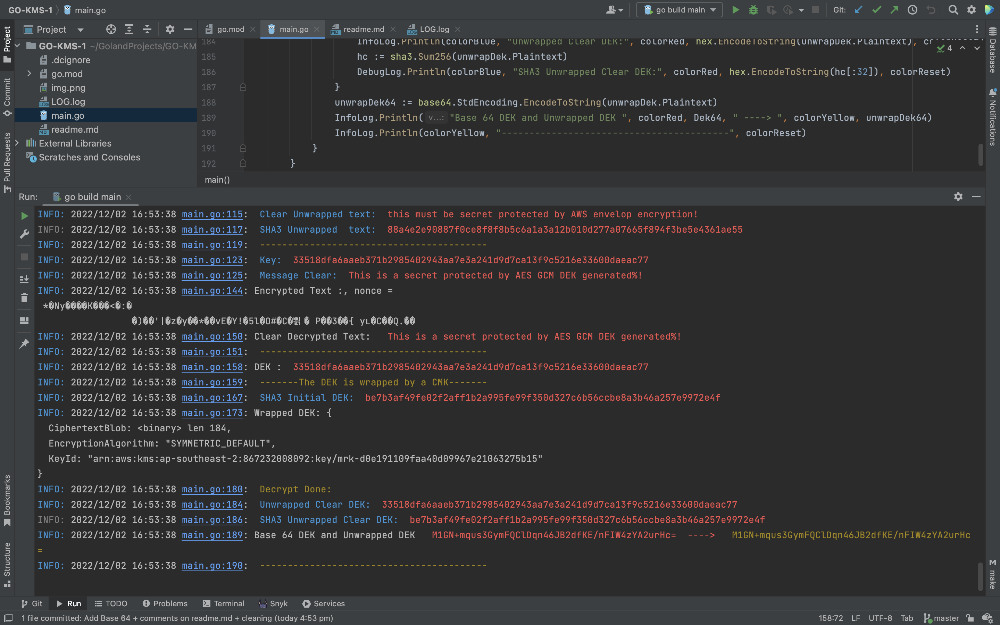

# AWS KMS example in Go for new starter

This is my first program in `Go` using `AWS KMS`.
The intent is to provide a simple program for people to step in `GO `Lang Programming.
AWS KMS SDK for `Go` is available at [ AWS kms.](https://aws.amazon.com/sdk-for-go/)

The program provide the following features :
- List all `KMS` Keys in the account 
- Encrypt/Decrypt for AES `CMK KMS` keys
- Provide additional examples for `SHA-3` and `AES GCM` using `go/crypto` package.
- Implement the wrapping of an 256 AES DEK generated with `crypto/rand` with AWS KMS. 
- Implement base64 conversion to store DEK

The program assumes that you will use credentials with the permission to support these operations.
Please refer to *aws configure* and make sure policies are properly set.

The execution **output** is similar to :

